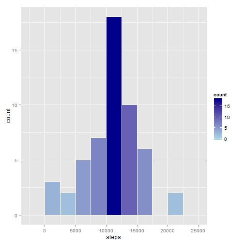
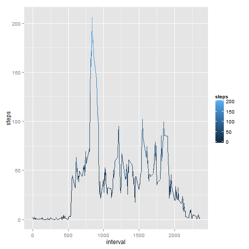
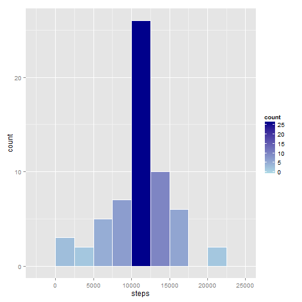
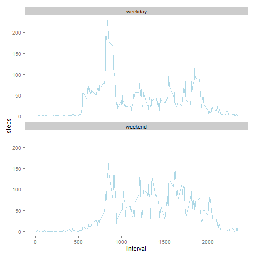

## Load the package dependencies

```r
require(dplyr)
require(ggplot2)
require(data.table)
require(timeDate)
```

## Loading and preprocessing the data

```r
##make sure the "activity.csv" file is located in your working directory
pa <- read.csv("~/activity.csv", header = TRUE)
```


## What is mean total number of steps taken per day?

```r
##Remove NA values
pa_complete <- pa[complete.cases(pa),]
rownames(pa_complete) <- NULL

##Calculate the total number of steps taken per day
steps_per_day <- aggregate(steps~date, data=pa_complete, FUN=sum)

##Create a histogram of number of steps per day
ghist <- ggplot(data=steps_per_day, aes(steps)) + 
  geom_histogram(col="white", 
                 aes(fill=..count..), binwidth=2500) +
  scale_fill_gradient("count", low = "lightblue", high = "darkblue")
plot(ghist)
```

 

```r
##Calculate the mean and median of steps taken per day
mean_steps_per_day <- mean(steps_per_day$steps)
print(mean_steps_per_day)
```

```
## [1] 10766.19
```

```r
median_steps_per_day <- median(steps_per_day$steps)
print(median_steps_per_day)
```

```
## [1] 10765
```

## What is the average daily activity pattern?

```r
##Make a time series plot (i.e. type = "l") of the 5-minute interval (x-axis) 
##and the average number of steps taken 
##averaged across all days (y-axis)

##calculate average number of steps per interval across all days
mean_steps_per_interval <- aggregate(steps~interval, data=pa_complete, FUN=mean)

##Create a plot of mean steps per interval (y_axis) vs. interval (x-axis)
gplot <- ggplot(data=mean_steps_per_interval, aes(x=interval, y=steps)) + 
  geom_line(aes(color=steps))
plot(gplot)
```

 

```r
##Get the interval with the highest average number of steps across all days
max_average_steps_interval <- mean_steps_per_interval[which.max(mean_steps_per_interval$steps), "interval"]
print(max_average_steps_interval)
```

```
## [1] 835
```

## Imputing missing values

```r
##Calculate and report the total number of missing values in the dataset 
pa_incomplete <- pa[!complete.cases(pa),]
missing_values <- nrow(pa_incomplete)
print(missing_values)
```

```
## [1] 2304
```

```r
##Strategy for filling in all of the missing values in the dataset
##Use interval mean to replace NA values
md <- merge(pa_incomplete, mean_steps_per_interval, by.x="interval", by.y="interval", all=TRUE)
md <- md[, c("steps.y", "date", "interval")]
colnames(md) <- c("steps", "date", "interval")
md <- data.table(md, key=c("date", "interval"))
pa_complete <- data.table(pa_complete, key=c("date", "interval"))

##combine md and pa_complete
l <- list(pa_complete, md)
pa_full <- rbindlist(l)
##sort the rows by date and interval to make the data look like original
pa_full <- pa_full[order(date, interval),]

##Make a histogram of the total number of steps taken each day
##Calculate the total number of steps taken per day
steps_per_day_full <- aggregate(steps~date, data=pa_full, FUN=sum)

##Create a histogram of number of steps per day
ghist_full <- ggplot(data=steps_per_day_full, aes(steps)) + 
  geom_histogram(col="white", 
                 aes(fill=..count..), binwidth=2500) +
  scale_fill_gradient("count", low = "lightblue", high = "darkblue")
plot(ghist_full)
```

 

```r
##Calculate the mean and median of steps taken per day with the imputed data
mean_steps_per_day_full <- mean(steps_per_day_full$steps)
print(mean_steps_per_day_full)
```

```
## [1] 10766.19
```

```r
median_steps_per_day_full <- median(steps_per_day_full$steps)
print(median_steps_per_day_full)
```

```
## [1] 10766.19
```


## Are there differences in activity patterns between weekdays and weekends?

```r
##Create a new factor variable in the dataset with two levels "weekday" and "weekend"
DayType <- function(date){
  if(isWeekday(date)==TRUE)
    s <- "weekday"
  else 
    s <- "weekend"
  return(s)
}
pa_full$daytype <- sapply(pa_full$date, function(x) DayType(x))

##Calculate average of steps across all "weekdays" or "weekends"
mean_steps_by_daytype <- aggregate(steps~daytype+interval, data = pa_full, FUN=mean)

##Create a timeseries plot of interval (x-axis) vs mean steps by day type
gmeanbyday <- ggplot(data=mean_steps_by_daytype, aes(x=interval, y=steps)) + 
  geom_line(color="lightblue") + 
  facet_wrap(~daytype, ncol=1) + 
  theme(panel.grid.major = element_blank(), 
        panel.grid.minor = element_blank(), 
        panel.background = element_blank(), 
        axis.line = element_line(colour = "black"))
plot(gmeanbyday)
```

 
